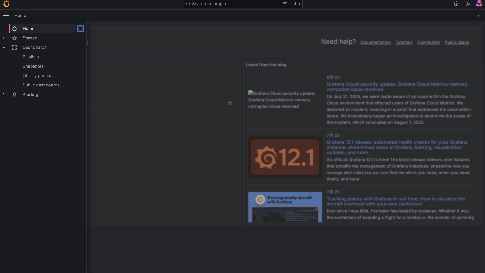
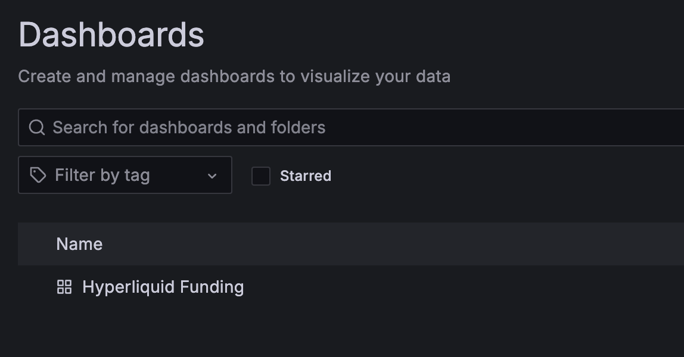
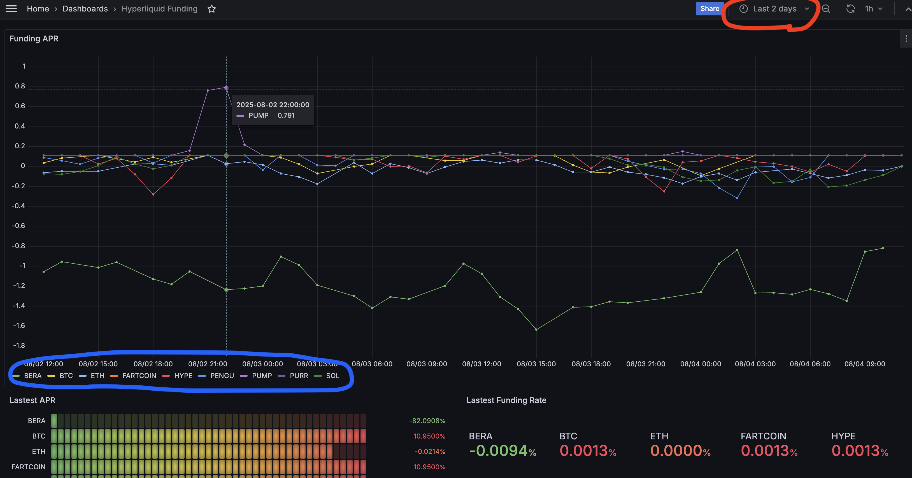

# Hyperliquid Funding Rate Dashboard

這是一個監控 Hyperliquid 永續合約資金費率的資料收集與視覺化專案。它會定期取得各幣種的 funding rate，換算年化報酬率（APR）並寫入 InfluxDB，再透過 Grafana dashboard 協助快速找出值得進一步評估的資金費率套利機會。

> 本專案提供監控與篩選資訊，不會自動下單。實際套利仍需評估現貨／永續合約對沖、交易手續費、滑價、借貸成本與清算風險。

## 功能

- 每小時取得 Hyperliquid 最新資金費率
- 顯示 funding rate 與換算後的 APR 排名
- 回補最近數日的歷史資料（預設 7 天）
- 將時間序列寫入 InfluxDB，供 Grafana 查詢與繪圖
- 依時間區間與單一幣種查看資金費率變化
- 可選擇將即時排行推送到 Telegram

目前程式預設監控 `BERA`、`BTC`、`ETH`、`FARTCOIN`、`HYPE`、`PENGU`、`PUMP`、`PURR` 與 `SOL`，可在 Python 腳本的 `SYMBOLS` 清單中調整。

## 架構

```text
Hyperliquid API → Python collectors → InfluxDB → Grafana dashboard
                                  └→ Telegram（可選）
```

## 快速開始

需求：Python 3、Docker 與 Docker Compose。

1. 建立本地環境設定：

   ```bash
   cp .env.example .env
   ```

   編輯 `.env`，至少設定 `INFLUXDB_TOKEN` 與強密碼 `INFLUXDB_INIT_PASSWORD`。`.env` 已被 Git 忽略，請勿提交任何真實 token 或密碼。

2. 啟動 InfluxDB 與 Grafana：

   ```bash
   docker compose -f decker-compose.yml up -d
   ```

3. 安裝 Python 套件：

   ```bash
   python -m pip install -r requirements.txt
   ```

4. 回補最近 7 天資料（可調整 `--days`）：

   ```bash
   python src/load_past_7days.py --days 7
   ```

5. 啟動每小時執行的即時收集器：

   ```bash
   python src/rank_fr_togua.py
   ```

Grafana 預設位於 `http://localhost:3000`。加入 InfluxDB data source 後，即可建立 funding rate、APR 排名、時間區間與單一幣種等面板。

## Dashboard 畫面






