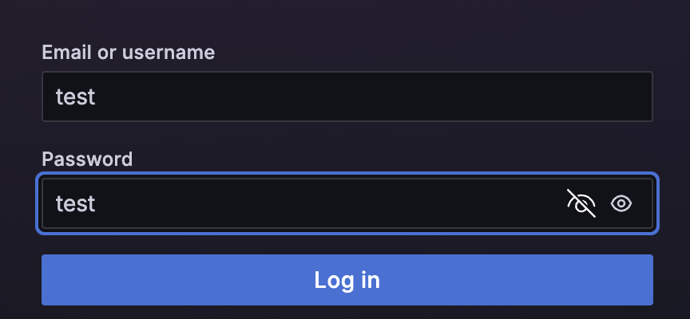

# Hyperliquid Funding Rate Monitor

## example

### website login
get in to the test website http://34.228.113.153:3000/
(both username and password are `test`)

### Open menu on the left and chose `Dashboard`

### chose get into the Hyperliquid Funding

### Result
(red circle part can select the certain timeframe,
blue circle part will shows single coin data)
